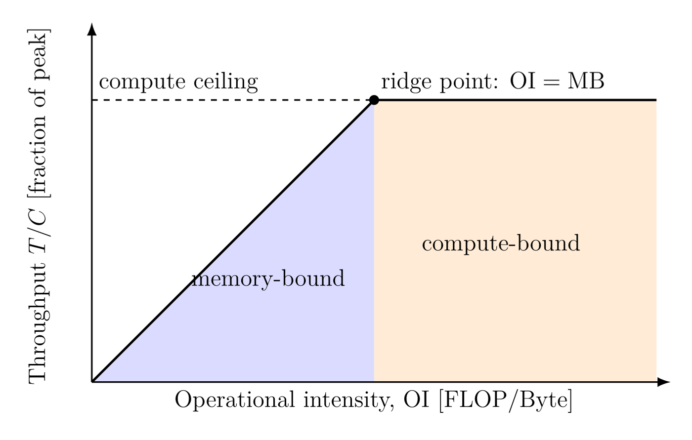
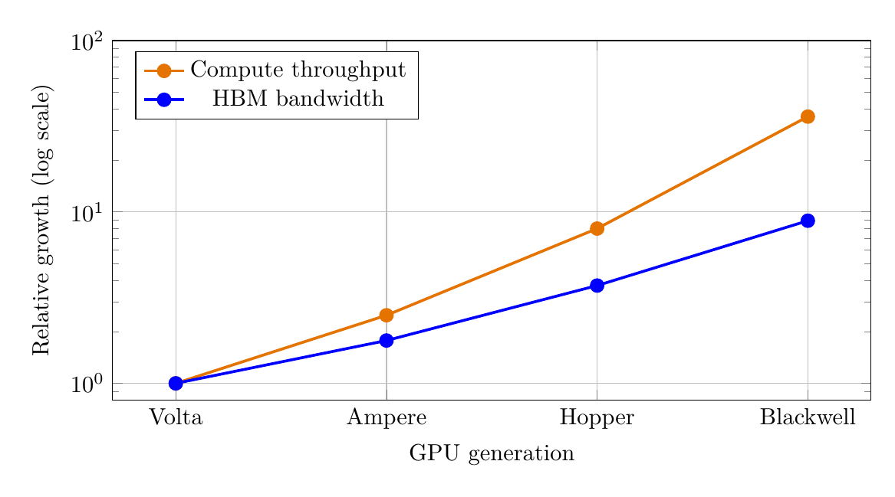

Published December 10, 2025 · Updated September 4, 2026

## [Quantifying the Utility of Disaggregated Memory in AI Systems, Part II](posts/disaggregated-memory-ai-systems-part-2/index.llms.md)

Part II extends the intensity framework to inference and distributed training, then develops design implications and open research questions.

Published December 10, 2025 · Updated September 4, 2026

## [Quantifying the Utility of Disaggregated Memory in AI Systems, Part I](posts/disaggregated-memory-ai-systems/index.llms.md)

Part I develops the roofline model, transformer intensity estimates, two-tier SRAM/HBM analysis, and the I/O ceiling for disaggregated memory.

Published August 27, 2026

## [Amdahl's Law: The Speedup You Cannot Exceed](posts/2026-08-27-amdahls-law/index.llms.md)

A reference post defining Amdahl's law in words and mathematics.

Published January 6, 2026

## [On Infinite Limits](posts/2026-01-06-infinite-limit.llms.md)

Real systems approach limits long before theory reaches infinity.
