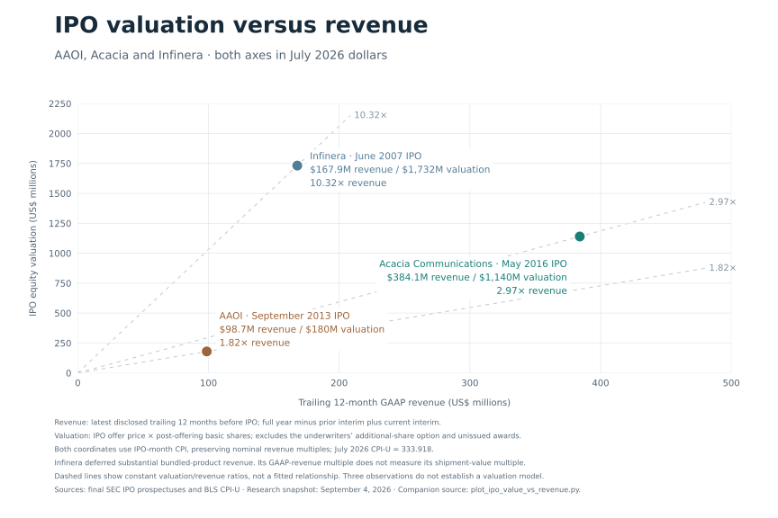
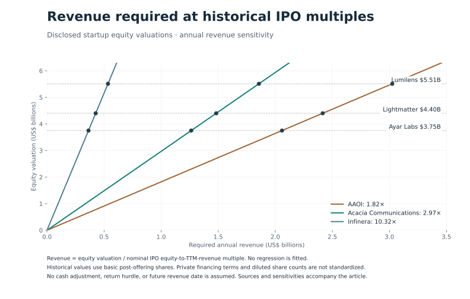

# AI Optics Is Being Priced for Success Before the Economics Are Proven

AI infrastructure

Optical interconnects

Valuation

Comparing optical startup valuations with historical IPO revenue multiples, gross margins, and implied shipment volumes.

Author

Brian D. Taylor

Published

September 4, 2026

Modified

September 4, 2026

Optical interconnects could become one of the most important technologies in AI infrastructure. That does not automatically make optical startups attractive investments at any price.  Prior to the AI age, optical companies that went public after the dotcom bubble burst included Infinera, Acacia, and Applied Optoelectronics (AAOI).   So I took a look at Infinera’s, Acacia’s, and AAOI’s public filings and adjusted them to 2026 dollars.

Acacia made remarkably efficient use of its capital. It raised approximately \$77 million in private funding in 2026 dollars and generated approximately \$337 million in inflation-adjusted revenue in 2015, the year before its IPO, at a 39.2% gross margin. By the trailing twelve months through March 2016, revenue had reached approximately \$384 million in 2026 dollars, with a 40.7% gross margin. Its business combined silicon photonics with its own digital signal-processing technology. [Acacia’s IPO prospectus](https://www.sec.gov/Archives/edgar/data/1651235/000119312516589514/d46988d424b4.htm).

Infinera went public in 2007, almost twenty years ago.  It commercialized large-scale photonic integration, operated its own fab, and sold optical transport systems.  Its trailing twelve-month GAAP revenue through March 2007 was \$104.8 million, approximately \$168 million in 2026 dollars.

Now fast-forward to today.  We see substantially higher levels of capital investment and much higher valuations, while public financial disclosure remains limited.

Ayar Labs, Lightmatter, and Lumilens carry disclosed valuations of roughly \$3.75 billion, \$4.4 billion, and \$5.51 billion respectively.   These valuations anticipate enormous commercial success. The question is what operating performance would support them.

| Company               | Private capital raised |      Valuation |
|-----------------------|-----------------------:|---------------:|
| Acacia Communications |    Approximately \$77M | \$1.14B at IPO |
| Infinera              |   Approximately \$522M | \$1.73B at IPO |
| Ayar Labs             |                 \$870M |        \$3.75B |
| Lightmatter           |                 \$850M |        \$4.40B |
| Lumilens              |       More than \$900M |        \$5.51B |

Historical figures are approximately restated in July 2026 purchasing power. IPO equity values and their trailing-revenue comparisons use the same IPO-month inflation factor; the standalone 2015 revenue figure uses the 2015 annual average.   Startup figures are their latest disclosed nominal funding totals and valuations, rather than independent estimates of current market value. Historical funding excludes IPO proceeds; the valuation column uses equity value at the IPO offer price.

The startup figures come from [Ayar Labs](https://ayarlabs.com/news/ayar-labs-closes-500m-series-e-accelerates-volume-production-of-co-packaged-optics/), [Lightmatter](https://lightmatter.co/about/), and [Lumilens](https://lumilens.com/news-insights/lumilens-emerges-with-900m-in-funding). Historical funding adjustments use aggregate funding dates and should be treated as approximate.

Raising more capital does not establish overvaluation. It does raise the question of how large and how profitable the resulting businesses must become.

Acacia provides a useful benchmark. Its \$820.1 million IPO equity valuation divided by \$276.3 million of trailing revenue gives a 2.97 times revenue multiple. Inflation adjustment is useful for comparing dollar amounts across decades. The multiples below use the original nominal valuation and revenue, so different inflation reference dates do not change the ratios.

AAOI adds a third IPO benchmark. Its September 2013 IPO priced at \$10 per share with 12,604,334 shares outstanding after the offering, giving an equity valuation of \$126.0 million, or approximately \$180 million in 2026 dollars. Trailing revenue through June 2013 was \$69.2 million, approximately \$98.7 million in 2026 dollars, with a 29.1% gross margin. Its IPO revenue multiple was approximately 1.82 times. The offering priced below its preliminary range; the \$10 offer price is the actual transaction price used here. [AAOI’s IPO prospectus](https://appliedoptoelectronics.gcs-web.com/node/7266/html).

| Company | TTM period ends | Nominal TTM revenue | Nominal IPO equity value | IPO revenue multiple |
|----|----|---:|---:|---:|
| AAOI | June 2013 | \$69.2M | \$126.0M | 1.82x |
| Acacia | March 2016 | \$276.3M | \$820.1M | 2.97x |
| Infinera | March 2007 | \$104.8M | \$1,080.8M | 10.32x |

 {#fig-ipo-comparison width=100% fig-align=“center”}

Each multiple uses the latest disclosed trailing twelve months before IPO. AAOI’s datacenter business contributed about 21% of trailing revenue, with CATV still its largest market. Its 29.1% margin is company-wide.

Infinera offers a more generous valuation benchmark, but a less reliable earnings comparison. Revenue deferrals and manufacturing ramp costs complicate using that multiple as a normal valuation standard. First-quarter revenue rose from \$2.7 million in 2006 to \$49.2 million in 2007, and the latter quarter included \$14.8 million of recognized deferred gross profit. This is an accounting-timing complication, not a reason to substitute invoiced shipments for GAAP revenue. It remains in the comparison because it shows how widely the market has valued optical businesses.

Its fab deserves attention, but it does not provide a clean adjustment. Near IPO, Infinera had \$57.7 million of gross property and equipment, approximately \$95 million in 2026 purchasing power, across the entire company. The filing does not isolate wafer-fab investment or operating costs. Subtracting that balance from funding would mix asset accounting with cumulative financing, while removing manufacturing expenses would ignore the foundry bill a fabless company would still incur. [Infinera’s IPO filing](https://www.sec.gov/Archives/edgar/data/1138639/000119312507131232/d424b4.htm).

These are equity-value-to-revenue comparisons. Historical equity values use the IPO offer price and basic shares outstanding immediately after the base offering. Startup figures are announced financing valuations; their fully diluted capitalization and preferred-share terms are not reconciled here. As a share-count sensitivity, increasing a historical IPO equity value by 10% increases its multiple by 10% and lowers the corresponding startup revenue requirement by 9.1%. That is an assumed sensitivity, not a measured dilution adjustment.

Cash is another difference. Converting this analysis to enterprise value requires subtracting net cash from both the historical IPO equity values, including net IPO proceeds, and the startup valuations. Cumulative funding is not a cash balance. Without disclosed startup cash and debt, an enterprise-value comparison cannot be completed. At a fixed enterprise-value multiple, each \$100 million of additional net cash would reduce required operating revenue by \$100 million divided by that multiple.

I use Acacia as the working baseline because it combined silicon photonics with proprietary DSP technology and had a profitable product business at IPO. That makes it a useful operating benchmark, not a universal valuation rule. AAOI and Infinera remain visible as alternative market outcomes; the required revenue changes substantially with the benchmark selected.

Applying each IPO revenue multiple to the disclosed startup valuations gives:

| Company     | At AAOI’s 1.82x | At Acacia’s 2.97x | At Infinera’s 10.32x |
|-------------|----------------:|------------------:|---------------------:|
| Ayar Labs   |         \$2.06B |           \$1.26B |              \$0.36B |
| Lightmatter |         \$2.42B |           \$1.48B |              \$0.43B |
| Lumilens    |         \$3.02B |           \$1.86B |              \$0.53B |

 {#fig-required-revenue width=100% fig-align=“center”}

These are comparable-multiple calculations, not forecasts or mandatory revenue thresholds. Investors can reasonably pay more for faster growth, stronger competitive advantages, or a larger opportunity. But those premiums need an economic explanation.

The base case asks what annual revenue would support today’s disclosed valuation at a historical IPO multiple. It does not assign that revenue to today or to a particular future year. For an explicit return scenario, assume a five-year holding period, a 20% annual equity return, no dilution, and an exit at Acacia’s revenue multiple. The required exit equity value is 2.49 times the starting valuation. That gives year-five nominal revenue of \$3.14 billion for Ayar Labs, \$3.69 billion for Lightmatter, \$4.62 billion for Lumilens. These are future nominal dollars, with no inflation adjustment. This scenario uses each disclosed valuation as the entry price; it does not claim that the financing rounds occurred on the same date. Additional dilution raises the exit value needed to deliver the same return to existing investors.

What would those revenues mean in physical shipments?

For the pricing model, I start with \$1 per gigabit per second at 400G, giving a \$400 module ASP. I then allow a 25% ASP premium for each subsequent doubling of bandwidth: \$500 for 800G and \$625 for 1.6T. Bandwidth doubles each generation while the module price increases by 1.25x, reducing the price per gigabit.

Facebook called for \$1/Gbps optics more than a decade ago. Describing his OFC 2014 presentation, Yuval Bachar wrote: “I put \$1/1G for SM 500m data center rated modules requirements on my slides”. [Yuval Bachar, “\$1/1G for 100G optics,” February 2016](https://www.cablinginstall.com/data-center/article/16473028/guest-blog-1-1g-for-100g-optics). I use that historical target as the starting point for this pricing model. The \$400, \$500, and \$625 prices are assumptions, not current hyperscaler procurement quotes.

| Generation | Assumed module ASP | Price per Gbps |
|------------|-------------------:|---------------:|
| 400G       |              \$400 |         \$1.00 |
| 800G       |              \$500 |        \$0.625 |
| 1.6T       |              \$625 |        \$0.391 |

Annual unit volume is simply annual revenue divided by realized average selling price. Using Acacia’s approximately 2.97 times IPO revenue multiple gives the following volumes:

| Company     | Annual revenue target | 400G at \$400 | 800G at \$500 | 1.6T at \$625 |
|-------------|----------------------:|--------------:|--------------:|--------------:|
| Ayar Labs   |               \$1.26B |         3.16M |         2.53M |         2.02M |
| Lightmatter |               \$1.48B |         3.71M |         2.96M |         2.37M |
| Lumilens    |               \$1.86B |         4.64M |         3.71M |         2.97M |

Using AAOI’s IPO revenue multiple with the same ASP assumptions gives these annual module-equivalent volumes:

| Company     | Annual revenue target | 400G at \$400 | 800G at \$500 | 1.6T at \$625 |
|-------------|----------------------:|--------------:|--------------:|--------------:|
| Ayar Labs   |               \$2.06B |         5.15M |         4.12M |         3.29M |
| Lightmatter |               \$2.42B |         6.04M |         4.83M |         3.86M |
| Lumilens    |               \$3.02B |         7.56M |         6.05M |         4.84M |

This AAOI case uses its revenue multiple directly, without an additional gross-margin adjustment. AAOI’s observed multiple already reflects the market’s valuation of its business, including its margin profile. The similarity between some AAOI revenue targets and the 25% margin scenario below is an arithmetic coincidence between two different calculations. The Acacia calculations remain the baseline for the blended-volume and margin scenarios below.

Each column assumes all revenue comes from that product. The figures count individual modules, rather than complete links. A conventional link with one module at each end requires two modules.

A 50/50 unit mix of 800G and 1.6T at these prices produces a \$562.50 blended ASP. Required annual shipments would then be approximately 2.25 million for Ayar, 2.64 million for Lightmatter, and 3.30 million for Lumilens.

At 1.6T, each company needs the revenue equivalent of approximately two to three million modules annually to match Acacia’s IPO revenue multiple. Moving to the next generation at a 25% higher ASP reduces the number of units needed for the same revenue by 20%. Separately, a 20% ASP decline within a generation requires 25% more units just to maintain revenue.

There is an important distinction here: these are scale-out module revenue equivalents, not forecasts of actual chip shipments.

The comparison applies most directly to Lumilens’s pluggable transceiver business. Ayar’s offering combines optical I/O chiplets with external light sources. Lightmatter sells photonic interconnect platforms and light engines, potentially representing much more bandwidth and value per selling unit. Their physical shipment requirements depend on their actual products, prices, and share of the system’s revenue. [Ayar’s product description](https://ayarlabs.com/teraphy), [Lightmatter’s product description](https://lightmatter.co/products/m1000/), and [Lumilens’s portfolio announcement](https://lumilens.com/news-insights/lumilens-emerges-with-900m-in-funding).

The exercise makes the revenue targets tangible. It does not establish that million-unit volumes are unattainable. LightCounting’s February 2026 forecast put 1.6T optical-transceiver shipments in the tens of millions of ports for 2026. That is a forecast of industry scale, not evidence of orders won by these startups. [LightCounting’s market forecast](https://www.lightcounting.com/newsletter/en/february-2026-pam4-and-coherent-dsps-updated-april-2026-381).

For a market-share sensitivity, assume an annual market of 20 million or 40 million 1.6T modules. These are illustrative denominators, not exact figures supplied by LightCounting. Lumilens’s 2.97 million annual module equivalents at \$625 represent 14.9% or 7.4% of those markets. That is a substantial share, but the arithmetic does not establish that the market is too small. Ayar’s and Lightmatter’s equivalents cannot be treated as pluggable market shares because their products and addressable markets differ.

Gross margin makes the comparison more demanding.

Finisar provides a useful historical reference for optical hardware. Its reported GAAP gross margins were 34.8% in fiscal 2017, 27.5% in 2018, and 27.2% in 2019. Those were company-wide figures across optical subsystems and components, not a clean breakout of datacenter “grey optics.” [Finisar’s annual report](https://www.sec.gov/Archives/edgar/data/1094739/000109473919000038/fnsr10kfy19.htm).

We can get closer to the transceiver business through Finisar’s earnings disclosures. On its March 2018 earnings call, CFO Kurt Adzema put fiscal Q2 revenue from 100G QSFP28 transceivers at approximately \$100 million and confirmed that Q3 delivered the expected approximately \$15 million increase. That puts this one transceiver family at approximately \$115 million of quarterly revenue, or a \$460 million annualized run rate. [Finisar’s March 2018 earnings call](https://www.fool.com/earnings/call-transcripts/2018/03/10/finisar-fnsr-q3-2018-earnings-conference-call-tran.aspx).

The shipment scale is instructive. Depending on the realized ASP, that quarterly revenue implies the following volumes:

| Assumed historical 100G module ASP | Quarterly modules | Annualized modules |
|------------------------------------|------------------:|-------------------:|
| \$200                              |           575,000 |              2.30M |
| \$300                              |           383,000 |              1.53M |
| \$400                              |           288,000 |              1.15M |

These are calculated volume scenarios, not reported unit shipments. The ASPs and revenue are in historical nominal dollars, and the annualized figures extrapolate one quarter. Even one Finisar transceiver family was operating at a revenue scale equivalent to more than a million modules per year under these assumptions.

Finisar’s broader datacom business generated approximately \$1.03 billion in fiscal 2018 and \$927 million in fiscal 2019, although that category also included sensing products. Its fiscal 2019 filing attributed a \$53.3 million decline in 100G datacom transceiver revenue primarily to lower average selling prices. The company also changed revenue-recognition standards in fiscal 2019. [Finisar’s annual report](https://www.sec.gov/Archives/edgar/data/1094739/000109473919000038/fnsr10kfy19.htm), [Finisar’s fiscal 2019 results](https://www.globenewswire.com/news-release/2019/06/13/1868692/0/en/finisar-announces-fiscal-2019-financial-results.html).

After acquiring Finisar, II-VI explicitly identified “Finisar’s Transceiver product line which has a lower gross margin profile than the Company’s historical margins.” II-VI’s preceding fiscal-year gross margin was 38.3%. It separately identified an \$87.7 million acquisition-related inventory charge, which should not be counted as normal transceiver manufacturing cost. [II-VI’s fiscal 2020 annual report](https://www.sec.gov/Archives/edgar/data/820318/000082031820000023/iivi-20200630.htm).

This gives us a more concrete comparison: substantial transceiver revenue, price erosion, and an explicit disclosure that the acquired transceiver business had lower margins than II-VI’s historical business. Finisar did not disclose a transceiver-only gross margin, so the 30% figure below remains a modeling assumption.

We should not assume Ayar, Lightmatter, and Lumilens will reproduce Finisar’s economics. Their products can have different competitive positions and cost structures. The 2017 to 2019 figures span different market conditions and product mixes; they do not establish a permanent margin ceiling. I use a 30% gross-margin scenario, with 25% to 50% sensitivities, to test the investment thesis. The higher cases allow for stronger chiplet and platform economics. Revenue multiples remain the main comparison; this is a separate gross-profit sensitivity.

At 30% gross margin, a company needs approximately 36% more revenue than a business earning Acacia’s 40.7% margin to generate the same gross profit.

Acacia’s nominal IPO equity value was 7.29 times trailing gross profit; AAOI’s was 6.26 times. Their closer gross-profit multiples are useful context, but two observations do not establish a common valuation rule. Holding Acacia’s relationship constant gives these illustrative annual revenue requirements:

| Company     | At 25% gross margin |  At 30% |  At 35% |  At 40% |  At 50% |
|-------------|--------------------:|--------:|--------:|--------:|--------:|
| Ayar Labs   |             \$2.06B | \$1.71B | \$1.47B | \$1.29B | \$1.03B |
| Lightmatter |             \$2.41B | \$2.01B | \$1.72B | \$1.51B | \$1.21B |
| Lumilens    |             \$3.02B | \$2.52B | \$2.16B | \$1.89B | \$1.51B |

The calculation takes the original revenue benchmark and multiplies it by 40.7% divided by the assumed gross margin.

At the illustrative \$562.50 blended module ASP, the 30% margin case translates into approximately 3.05 million, 3.58 million, and 4.48 million module equivalents annually. This is a separate, margin-adjusted scenario; the earlier shipment table uses Acacia’s revenue multiple alone.

These are substantial businesses. Gross profit still has to fund engineering, sales, administration, and ongoing investment.

There is also meaningful evidence supporting the new companies.

Lumilens says it is already shipping into production AI datacenters under a multibillion-dollar customer agreement. That is commercial progress. However, its announcement does not establish annual recognized revenue, gross margin, or the timing and economics of the agreement. [Lumilens’s announcement](https://lumilens.com/news-insights/lumilens-emerges-with-900m-in-funding).

The bullish case is that AI creates a much larger market, integration protects pricing, and rapid growth makes historical IPO multiples too conservative. That case could prove correct.

My skepticism is about how much of that outcome investors appear to be paying for already.

The public information reviewed here does not support a precise claim that these companies are “three times overvalued,” or any other numerical verdict. Private financing terms, cash balances, growth expectations, and customer commitments also complicate comparisons with public equity.

But the historical economics expose the scale of the bet. At Acacia-like valuation multiples and Finisar-like margins, these startups need annual revenue measured in billions. At illustrative scale-out optics prices, that represents annual sales equivalent to millions of modules, with the required volume increasing when realized ASPs decline within a generation.

I regard these valuations as excessive unless the companies can demonstrate either that scale or materially better economics. The evidence that would change my mind is concrete: sustained recognized revenue, production yields, repeat customer demand, and gross margins that survive volume deployment.

Optical technology may be essential to AI’s future. Investors still need to establish how much of that value its suppliers can keep.

Reproducible chart calculations: [Python source](assets/plot_ipo_value_vs_revenue.py).
