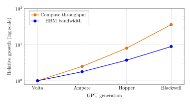
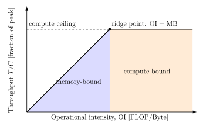
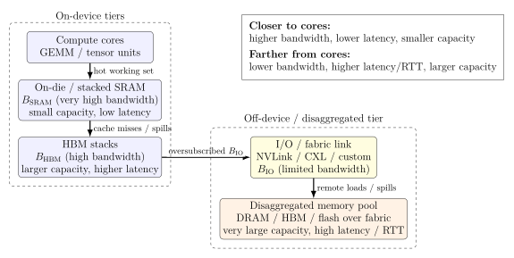

# Quantifying the Utility of Disaggregated Memory in AI Systems, Part I

An operational- and communication-intensity view of compute, memory, and I/O ceilings

AI infrastructure

GPU architecture

HBM

disaggregated memory

performance engineering

Part I develops the roofline model, transformer intensity estimates, two-tier SRAM/HBM analysis, and the I/O ceiling for disaggregated memory.

Author

Brian D. Taylor

Published

December 10, 2025

Modified

September 4, 2026

> **NOTE:**
>
> This is Part I of the complete paper. It covers Sections 1–7: the roofline model, operational intensity, transformer kernels, SRAM/HBM tiers, and the disaggregated-memory I/O ceiling. [Continue to Part II](../disaggregated-memory-ai-systems-part-2/), which covers inference, distributed training, design implications, future work, and the conclusion.

> **NOTE:**
>
> [Read or download the complete paper (PDF)](../../downloads/disaggregated-memory-ai-systems.pdf)

## Abstract

Recent claims around “breakthrough” disaggregated HBM have raised expectations that remote memory fabrics could shift large-scale AI training from being memory-bound to compute-bound. This note grounds those claims in a simple, intensity-based performance model that unifies compute, memory, I/O, and network ceilings. Our scope is deliberately narrow: we ask whether disaggregated memory bandwidth alone can push a transformer training step across the compute-bound ridge point, not whether disaggregated memory has value more broadly (e.g., via added capacity, model fit, or pooling), questions we return to briefly but do not attempt to quantify. Using the roofline framework, we express kernels and training steps in terms of operational intensity (OI) and show that modern transformer workloads typically operate in the 30–80 FLOP/Byte regime. For PFLOP-class accelerators, this implies required per-device bandwidths on the order of 10–40 TB/s to reach the compute roofline, with even higher requirements for future 5–10 PFLOP devices. Existing HBM and plausible on-die SRAM tiers can raise effective bandwidth and utilization but cannot close this gap. We then introduce an I/O ceiling for disaggregated memory and show that even the most aggressive published fabrics (\\\lesssim 14\\ TB/s) fall one to two orders of magnitude short of the bandwidth needed if remote memory were the limiting tier, and therefore are insufficient to make transformer workloads compute-bound. Extending the same logic to distributed training, we define a communication roofline based on communication intensity (CI) and network bandwidth, and show how collective communication can become the dominant ceiling even when local memory bandwidth is ample. Overall, the framework provides a compact set of equations for diagnosing which ceiling is active and for evaluating architectural proposals, including additional HBM stacks, SRAM tiers, disaggregated memory, or network upgrades, in terms of the operational and communication intensities of real workloads.

## 1 Introduction

Recently there has been a surge of excitement around companies claiming breakthroughs in disaggregated HBM, including at least one high-profile acquisition based on the idea that remote HBM could fundamentally shift AI systems from being memory-bound to compute-bound. Given these claims, it is important to ground expectations in first-principles scaling laws that describe how modern AI workloads actually consume compute and memory.

For today’s large transformer models, the amount of arithmetic performed per byte of memory accessed, known as operational intensity (OI), is relatively low, typically in the 30–80 FLOP/Byte range. To fully utilize PFLOP-class accelerators, a memory system must deliver bandwidth equal to compute/OI, which works out to 10–40 TB/s per device. Current HBM falls short of this threshold, and even adding large, fast SRAM tiers cannot reach the required effective bandwidth. Disaggregated memory fabric links are even further behind, constrained to only a fraction of the bandwidth required to feed modern accelerators at peak. As shown in [Table 1](#tbl-gpu-growth) and [Figure 1](#fig-gpu-growth), peak compute has grown roughly \\36\times\\ since Volta, while HBM bandwidth has grown only about \\9\times\\ over the same four generations, so the compute-to-bandwidth gap has itself widened by roughly \\4\times\\ and continues to widen with each new generation.

| GPU Generation | Peak Compute | HBM Bandwidth | Relative Growth |
|:---|:---|:---|:---|
| Volta (V100) | 0.125 PFLOP/s | 0.9 TB/s | Baseline (\\1.0\times\\ vs. \\1.0\times\\) |
| Ampere (A100) | 0.312 PFLOP/s | 1.6 TB/s | \\2.5\times\\ compute / \\1.8\times\\ memory |
| Hopper (H100) | 1.0 PFLOP/s | 3.35 TB/s | \\8.0\times\\ compute / \\3.7\times\\ memory |
| Blackwell (GB200) | 4.5 PFLOP/s | 8.0 TB/s | \\36\times\\ compute / \\8.9\times\\ memory |

Table 1: Representative peak compute throughput and HBM bandwidth across four GPU generations, normalized to Volta (V100) as baseline. All figures are dense (non-sparse) FP16/BF16 throughput for consistency across generations; the Blackwell row reflects the dual-die GB200 superchip, matching the device modeled in the worked example of [Section 6.1](#sec-sram-worked).

Figure 1: Relative growth of compute and HBM bandwidth as a function of GPU generation, plotted directly from the values in [Table 1](#tbl-gpu-growth) (Volta = \\1.0\times\\ baseline).

We will show that increasing on-package bandwidth (HBM) and adding fast on-die or stacked SRAM tiers can improve utilization, but neither is sufficient to make modern transformer training compute-bound under realistic step-level operational intensities. Disaggregated memory, as we model it here, primarily increases addressable capacity; with current and near-term I/O ceilings it is not expected to move typical transformer workloads into a compute-bound regime. Throughout this note, we therefore focus narrowly on the minimum bandwidth required for modern transformer workloads to become compute-bound at the device level. To maintain analytical clarity, we intentionally omit several practical considerations that further reduce achievable performance in deployed systems, such as latency and RTT sensitivity, bandwidth-delay product constraints, queuing and prefetch depth, granularity and coherence effects, and memory reliability and error rates. Each of these factors lowers effective delivered bandwidth relative to the idealized values considered here; accordingly, the bounds we derive should be interpreted as roofline upper limits rather than predictions of realized utilization. Likewise, we do not attempt to quantify capacity-driven system-level benefits of disaggregated memory (e.g., model fit, memory pooling, or reduced stranding), which are orthogonal to the compute-bound question considered here. Finally, our numerical examples ([Table 1](#tbl-gpu-growth) and [Section 6](#sec-two-tier) and [Section 7](#sec-disaggregated)) are calibrated to NVIDIA-style GPUs with off-chip HBM stacked behind a smaller on-die SRAM tier. Architectures that respond to the same memory wall differently, including wafer-scale designs that keep an entire model in very large on-die SRAM with no off-chip HBM in the critical path or TPU-style pods built around a different optical-circuit-switched fabric, are not modeled here and may face a different balance of ceilings than the one derived below.

## 2 Purpose and Overview

Here we provide a compact, reusable set of equations for reasoning about where large-scale AI training is fundamentally limited:

- By device compute throughput (FLOP/s),

- By local memory bandwidth (e.g., HBM and SRAM),

- By off-package I/O (e.g., NVLink/PCIe/CXL),

- Or by distributed communication (e.g., all-reduce over a training network).

We use the **roofline model** ([Williams et al. 2009](#ref-williams2009)) as the organizing framework. In that model, a kernel or training step is described by:

- Its *operational intensity* (OI): FLOPs executed per byte moved from the limiting memory tier.

- The machine’s *machine balance* (MB): peak FLOPs per byte per second of sustained memory bandwidth for that tier.

Comparing OI to MB tells us whether a workload is *compute-bound* or *memory-bound* at a given tier. We then extend the same logic to two-tier memories (SRAM + HBM), disaggregated memory behind an I/O ceiling, and network collectives.

## 3 Notation (Symbols and Units)

| Symbol | Meaning | Typical units |
|:---|:---|:---|
| \\F\\ | Floating-point operations executed | FLOP |
| \\M\\ | Bytes moved from the limiting memory tier | Byte |
| \\\mathrm{OI}\\ | Operational intensity \\=F/M\\ | FLOP/Byte |
| \\C\\ | Peak compute throughput (device ceiling) | FLOP/s |
| \\B\\ | Sustained bandwidth for the limiting tier | Byte/s |
| \\\mathrm{MB}\\ | Machine balance \\=C/B\\ | FLOP/Byte |
| \\T\\ | Achievable throughput (roofline-bound) | FLOP/s |
| \\U\\ | Compute utilization \\=T/C\\ | Dimensionless |
| \\s\\ | Bytes per element (e.g., FP16/BF16 \\\Rightarrow s=2\\) | Byte/element |
| \\B\_{\mathrm{SRAM}}\\ | Bandwidth of SRAM tier | Byte/s |
| \\B\_{\mathrm{HBM}}\\ | Bandwidth of HBM tier | Byte/s |
| \\h\\ | Hit rate in fast tier (SRAM) | Dimensionless |
| \\B\_{\mathrm{IO}}\\ | Off-package I/O bandwidth ceiling | Byte/s |
| \\B\_{\mathrm{net}}\\ | Network bandwidth for collectives | Byte/s |
| \\N\\ | Number of devices/ranks | Dimensionless |
| \\S\\ | Model state communicated (e.g., gradients) | Byte |
| \\\alpha\\ | Collective latency term (startup / RTT dominated) | s |
| \\\beta\\ | Inverse bandwidth term (\\\beta\approx1/B\_{\mathrm{net}}\\) | s/Byte |
| \\T\_{\mathrm{comp}}\\ | Compute time per step | s |
| \\T\_{\mathrm{comm}}\\ | Communication time per step | s |
| \\\mathrm{CI}\\ | Communication intensity (Bytes/FLOP) | Byte/FLOP |

Table 2: Notation used throughout the paper, including compute, memory, I/O, and communication parameters.

## 4 The Roofline Model

### 4.1 What is the roofline model?

The **roofline model** ([Williams et al. 2009](#ref-williams2009)) is a simple performance model that upper-bounds the attainable throughput of a kernel or workload based on:

- The peak compute rate \\C\\ of the device (FLOP/s), and

- The sustained memory bandwidth \\B\\ of the limiting tier (Byte/s).

On a standard roofline plot:

- The horizontal axis is the *operational intensity* OI (FLOP/Byte).

- The vertical axis is the attained performance \\T\\ (FLOP/s).

There are two ceilings:

1.  A flat *compute roof* at \\T=C\\ (limited by arithmetic throughput).

2.  A sloped *memory roof* at \\T=\mathrm{OI}\cdot B\\ (limited by bandwidth).

The achievable performance is the minimum of these two: \\ T(\mathrm{OI})=\min\\C,\\ \mathrm{OI}\cdot B\\. \tag{1}\\ [Figure 2](#fig-roofline) illustrates the roofline and ridge line concepts and outlines memory-bound and compute-bound regions.

Figure 2: Roofline model: memory-bound region (blue) and compute-bound region (orange) relative to the ridge point \\\mathrm{OI}=\mathrm{MB}=C/B\\.

### 4.2 Operational intensity (OI)

Following Williams et al. ([Williams et al. 2009](#ref-williams2009)), the **operational intensity** of a kernel or training step with respect to a given memory tier is: \\ \mathrm{OI}\triangleq \frac{F}{M}\qquad\[\text{FLOP/Byte}\], \tag{2}\\ where \\F\\ is the number of FLOPs executed and \\M\\ is the number of bytes moved from the tier of interest (e.g., HBM).

Intuitively, OI measures how much arithmetic work you get per byte loaded from that tier. Higher OI means better reuse and less bandwidth pressure for a fixed amount of compute.

### 4.3 Machine balance (MB)

The **machine balance** for a given memory tier is: \\ \mathrm{MB}\triangleq \frac{C}{B}\qquad\[\text{FLOP/Byte}\], \tag{3}\\ where \\C\\ is peak compute throughput and \\B\\ is sustained bandwidth for that tier.

In roofline terminology ([Williams et al. 2009](#ref-williams2009); [Hennessy and Patterson 2019](#ref-hennessy2019)), MB is the “ridge point”: it is the operational intensity at which the bandwidth roof and compute roof intersect.

- If \\\mathrm{OI}\<\mathrm{MB}\\, the workload is *memory-bound*: its throughput is limited by \\B\\, not by \\C\\.

- If \\\mathrm{OI}\geq\mathrm{MB}\\, the workload can be compute-bound, assuming no other ceiling (e.g., I/O or network) intervenes.

### 4.4 Utilization under the roofline

Compute utilization is the fraction of peak FLOPs actually delivered: \\ U\triangleq\frac{T}{C}=\min\left\\1,\frac{\mathrm{OI}\cdot B}{C}\right\\. \tag{4}\\ Equivalently, if \\\mathrm{OI}\<\mathrm{MB}\\, then \\\mathrm{OI}\cdot B/C=\mathrm{OI}/\mathrm{MB}\<1\\ and utilization is proportional to OI.

### 4.5 Bandwidth required to become compute-bound

Rearranging the condition for compute-bound behavior, \\\mathrm{OI}\cdot B\geq C\\ gives the required bandwidth to saturate compute at a given OI: \\ B\_{\mathrm{req}}=\frac{C}{\mathrm{OI}}. \tag{5}\\ This expression is useful for quickly answering questions of the form: *“If my training block has \\\mathrm{OI}\approx50\\ FLOP/Byte and my device is 1 PFLOP/s, how much memory bandwidth do I actually need for compute-bound training?”*

## 5 Example Kernels: GEMM and Transformer Blocks

### 5.1 GEMM (general matrix multiplications)

For a dense GEMM of shape \\(M\times K)\cdot(K\times N)\\, the FLOPs are: \\ F\_{\mathrm{GEMM}}=2MKN. \tag{6}\\ A common, simple traffic model (reading each input once and writing the output once) is: \\ M\_{\mathrm{bytes}}\approx(MK+KN+MN)\cdot s, \tag{7}\\ where \\s\\ is bytes per element (e.g., \\s=2\\ for FP16/BF16). Then: \\ \mathrm{OI}\_{\mathrm{GEMM}}\approx\frac{2MKN}{(MK+KN+MN)\cdot s}. \tag{8}\\ For large matrices with reasonable blocking, GEMM can reach high OI and often sits in a compute-bound regime on modern accelerators.

### 5.2 Transformer block (back-of-the-envelope)

A common rough approximation of FLOPs per token per layer for a transformer block (in terms of hidden size \\d\\ and sequence length \\n\\) is: \\ F\_{\mathrm{tok}}\approx12d^2+4dn, \tag{9}\\ which follows the standard FLOP accounting for the feed-forward network (FFN) and attention (e.g., De Vries ([Vries 2024](#ref-devries2024)), the JAX transformer notes ([JAX/Google 2025](#ref-jax2025)), and Timbers ([Timbers 2024](#ref-timbers2024))).

A crude traffic proxy (ignoring caches and fusions) is: \\ M\_{\mathrm{tok}}\approx6d+2n\qquad\[\text{Bytes, up to a constant factor}\], \tag{10}\\ consistent with the per-token KV/cache and activation byte counts in Kipply ([Kipply 2022](#ref-kipply2022)) and related analyses. Then: \\ \mathrm{OI}\_{\mathrm{tok}}\approx\frac{F\_{\mathrm{tok}}}{M\_{\mathrm{tok}}}. \tag{11}\\ In practice, real Transformer training and inference steps mix high-OI matmuls with lower-OI components such as softmax, layer normalization, and elementwise operations. Empirical profiling therefore finds that the effective step-level arithmetic intensity for modern LLMs is typically in the “tens of FLOPs per byte” regime, e.g., on the order of 30–80 FLOP/Byte ([Baseten 2025](#ref-baseten2025); [Kim et al. 2023](#ref-kim2023); [Gholami et al. 2024](#ref-gholami2024); [ObjectiveMind.AI 2025](#ref-objectivemind2025)).

## 6 Two-Tier Memory: SRAM + HBM

Modern accelerators increasingly add a fast on-die or stacked SRAM tier in front of HBM. Let:

- \\B\_{\mathrm{SRAM}}\\ be the bandwidth of the SRAM tier,

- \\B\_{\mathrm{HBM}}\\ be the bandwidth of the HBM tier,

- \\h\\ be the fraction of traffic (bytes) served by SRAM (the SRAM “hit rate”).

A first-order, effective bandwidth model is: \\ B\_{\mathrm{eff}}\approx h\cdot B\_{\mathrm{SRAM}}+(1-h)\cdot B\_{\mathrm{HBM}}. \tag{12}\\ Higher \\h\\ moves the workload closer to a compute-bound regime by increasing \\B\_{\mathrm{eff}}\\, and thus raising the effective machine balance: \\ \mathrm{MB}\_{\mathrm{eff}}\approx\frac{C}{B\_{\mathrm{eff}}}. \tag{13}\\

### 6.1 Worked example with an SRAM tier (GB200-class device)

Consider a Blackwell-class (GB200) accelerator with:

- Peak compute: \\C\approx4.5\times10^{15}\\ FLOP/s (4.5 PFLOP/s FP16/BF16).

- HBM bandwidth: \\B\_{\mathrm{HBM}}=8\\ TB/s.

- Hypothetical SRAM bandwidth: \\B\_{\mathrm{SRAM}}=32\\ TB/s.

We examine a transformer block whose effective operational intensity is \\\mathrm{OI}\approx50\\ \text{FLOP/Byte}.\\

#### 6.1.1 Step 1: Single-tier HBM (no SRAM).

The machine balance for the HBM tier is: \\\mathrm{MB}\_{\mathrm{HBM}}=\frac{C}{B\_{\mathrm{HBM}}}=\frac{4.5\times10^{15}}{8\times10^{12}}\approx560\\ \text{FLOP/Byte}.\\ Since \\\mathrm{OI}=50\ll560\\, the workload is strongly memory-bound. The maximum attainable throughput from HBM is: \\T\_{\mathrm{HBM}}=\mathrm{OI}\cdot B\_{\mathrm{HBM}}=50\times8\times10^{12}\\ \text{FLOP/s}=4\times10^{14}\\ \text{FLOP/s},\\ which is only about 9% of the 4.5 PFLOP/s compute peak.

#### 6.1.2 Step 2: Add an SRAM tier with hit rate \\h=0.75\\.

Assume that with an SRAM tier we can serve 75% of the bytes from SRAM: \\h=0.75.\\ Then the effective bandwidth is: \\ \begin{aligned} B\_{\mathrm{eff}}&\approx hB\_{\mathrm{SRAM}}+(1-h)B\_{\mathrm{HBM}}\\ &=0.75\times32\\ \text{TB/s}+0.25\times8\\ \text{TB/s}\\ &=24\\ \text{TB/s}+2\\ \text{TB/s}\\ &=26\\ \text{TB/s}. \end{aligned} \\ The new machine balance is: \\\mathrm{MB}\_{\mathrm{eff}}=\frac{C}{B\_{\mathrm{eff}}}=\frac{4.5\times10^{15}}{26\times10^{12}}\approx1.7\times10^2\\ \text{FLOP/Byte}.\\ We still have \\\mathrm{OI}=50\<170\\, so the workload is still memory-bound, but less severely. The attainable throughput becomes: \\T\_{\mathrm{eff}}=\mathrm{OI}\cdot B\_{\mathrm{eff}}=50\times26\times10^{12}\\ \text{FLOP/s}=1.3\times10^{15}\\ \text{FLOP/s},\\ which is about 29% of peak instead of 9%.

#### 6.1.3 Step 3: Can we ever make this workload compute-bound with these tiers?

To be compute-bound at \\\mathrm{OI}=50\\, we would need: \\B\_{\mathrm{req}}=\frac{C}{\mathrm{OI}}=\frac{4.5\times10^{15}}{50}=9\times10^{13}\\ \text{Byte/s}=90\\ \text{TB/s}.\\ Even if \\h=1\\ (all traffic served from SRAM), the maximum effective bandwidth is: \\B\_{\mathrm{eff,max}}=B\_{\mathrm{SRAM}}=32\\ \text{TB/s}\<B\_{\mathrm{req}}.\\ Therefore, no choice of \\h\\ can make this particular workload compute-bound on this device, given \\B\_{\mathrm{SRAM}}=32\\ TB/s and \\B\_{\mathrm{HBM}}=8\\ TB/s. The SRAM tier substantially improves utilization (from \\\sim9\\\\ to \\\sim29\\\\), but the step remains memory-limited.

## 7 Disaggregated Memory and the I/O Ceiling

[Figure 3](#fig-tiered-memory) illustrates the resulting tiered memory hierarchy: fast on-device SRAM and HBM tiers feed into an off-device, disaggregated memory pool over a bandwidth-limited I/O or fabric link.

Now consider disaggregated memory that lives off-package (e.g., across a memory fabric) and is fed into the accelerator over a finite I/O interface with bandwidth \\B\_{\mathrm{IO}}\\. Even if the remote memory pool itself is very fast, the delivered bandwidth into the device cannot exceed: \\ B\_{\mathrm{delivered}}\leq\min\\B\_{\mathrm{remote\\ mem}},\\ B\_{\mathrm{IO}}\\. \tag{14}\\ In roofline terms, the relevant machine balance becomes: \\\mathrm{MB}\_{\mathrm{disagg}}=\frac{C}{B\_{\mathrm{delivered}}}.\\

Figure 3: Tiered memory hierarchy for an accelerator: fast on-device SRAM and HBM tiers feed into an off-device, disaggregated memory pool over a bandwidth-limited I/O or fabric link.

### 7.1 Practical Limits: Why Disaggregated Memory Is Insufficient to Achieve Compute-Bound Transformer Training Under Current I/O Ceilings

The analysis above shows how local memory bandwidth determines whether a kernel or training step lies on the sloped (bandwidth-bound) or flat (compute-bound) portion of the roofline. We now examine whether disaggregated memory can realistically raise the effective bandwidth \\B\_{\mathrm{delivered}}\\ enough to move a transformer workload into the compute-bound regime.

Recall that the condition for compute-bound execution is \\B\_{\mathrm{delivered}}\geq B\_{\mathrm{req}}=\frac{C}{\mathrm{OI}},\\ where typical operational intensities for modern models lie in the range \\\mathrm{OI}\approx30\\–\\80\\ FLOP/Byte. For accelerators with \\C=1\\–\\10\\ PFLOP/s, the required bandwidth is therefore \\B\_{\mathrm{req}}\approx12.5\text{--}333\\ \text{TB/s},\\ depending on workload structure and model architecture.

#### 7.1.1 Published I/O bandwidths fall far below this threshold.

Concrete, vendor-published figures for existing disaggregated-memory fabrics include:

- **CXL 2.0/3.0:** 64–128 GB/s per direction (\\\ll1\\ TB/s),

- **PCIe Gen5/6:** 64–128 GB/s per direction,

- **NVLink (Hopper/Blackwell):** 0.9–2.4 TB/s aggregate,

- **Celestial Photonic Fabric:** \\\sim7.2\\ Tbps \\\approx0.9\\ TB/s,

- **Lightmatter Passage Photonic Interconnect:** 114 Tbps \\\approx14.25\\ TB/s (the highest published value to date).[^1]

Even under the most generous interpretation of these data, the maximum achievable delivered bandwidth into an accelerator via a disaggregated memory fabric is \\B\_{\mathrm{delivered,max}}\approx14\\ \text{TB/s}.\\

Because this figure rests on a single vendor’s published number, it is worth checking how much the conclusion depends on it. Discounting it by a factor of \\2\\–\\3\times\\, to account for the gap between a vendor specification and sustained, real-world delivered bandwidth, gives \\B\_{\mathrm{delivered,max}}\approx5\\–\\7\\ TB/s. Recomputing the ratios below with 7 TB/s in place of 14 TB/s roughly doubles each factor (e.g., the \\1.4\times\\ case becomes \\\approx2.9\times\\, and the \\9\\–\\25\times\\ case becomes \\\approx18\\–\\48\times\\): the gap only widens under a more conservative reading of the vendor figure, so the conclusion is not sensitive to taking this number at face value.

This analysis treats the disaggregated interface as the limiting memory feed; that is, we evaluate the extreme regime in which remote memory would need to supply the full bandwidth required to reach the compute roofline.

**Key Result:** Even the highest published disaggregated-memory fabrics offer delivered bandwidth \\B\_{\mathrm{delivered}}\\ one to two orders of magnitude below the \\B\_{\mathrm{req}}=C/\mathrm{OI}\\ that would be required if remote memory were the limiting tier, and therefore are insufficient to make transformer workloads compute-bound via bandwidth supplied across the disaggregated I/O interface. \\\text{factor of }\frac{B\_{\mathrm{req}}}{B\_{\mathrm{delivered,max}}}\approx \begin{cases} 2.3\times & (\mathrm{OI}=30,\\ C=1\\ \text{PFLOP/s}),\\ 1.4\times & (\mathrm{OI}=50,\\ C=1\\ \text{PFLOP/s}),\\ 9\text{--}25\times & (C=10\\ \text{PFLOP/s},\\ \mathrm{OI}=80\text{--}30). \end{cases}\\

### 7.2 A More Realistic Deployment: Disaggregated Memory as an Overflow Tier

Section 7.1 evaluates the extreme case in which disaggregated memory would need to supply the entire byte stream for a step to reach the compute roofline. In practice, no serious deployment uses disaggregated memory this way: it sits behind SRAM and HBM as a capacity overflow tier for cold or infrequently accessed bytes, such as optimizer state and checkpoint data offloaded to slower tiers ([Rajbhandari et al. 2021](#ref-rajbhandari2021)), KV-cache pages evicted from HBM to CXL-attached memory ([Tang et al. 2024](#ref-tang2024)), or stranded host/pooled memory reclaimed for capacity rather than bandwidth ([Li et al. 2023](#ref-li2023)). This is the same tiered role SRAM plays in front of HBM in [Section 6](#sec-two-tier). We can extend the blended-bandwidth model of [Equation 12](#eq-effective-bw) to three tiers: \\B\_{\mathrm{eff}}\approx h\_{\mathrm{SRAM}}B\_{\mathrm{SRAM}}+h\_{\mathrm{HBM}}B\_{\mathrm{HBM}}+h\_{\mathrm{remote}}B\_{\mathrm{delivered}}, \qquad h\_{\mathrm{SRAM}}+h\_{\mathrm{HBM}}+h\_{\mathrm{remote}}=1.\\

Returning to the GB200-class worked example of [Section 6.1](#sec-sram-worked) (\\h\_{\mathrm{SRAM}}=0.75\\), suppose a modest \\h\_{\mathrm{remote}}=0.08\\ of bytes, consisting of cold or infrequently touched state rather than the hot working set, are served from a disaggregated pool at the most generous published delivered bandwidth from Section 7.1, \\B\_{\mathrm{delivered}}\approx14\\ TB/s, instead of from local HBM (\\B\_{\mathrm{HBM}}=8\\ TB/s): \\B\_{\mathrm{eff}}\approx0.75(32)+0.17(8)+0.08(14)=24+1.36+1.12=26.48\\ \text{TB/s},\\ versus 26 TB/s without the disaggregated tier. Utilization rises marginally, from 29% to about 29.4%. This confirms rather than overturns the paper’s central claim: at the per-step bandwidth level, disaggregated memory used as an overflow tier buys a small, real, but not transformative improvement, nowhere near enough to approach the ridge point. The gain is modest precisely because disaggregated bandwidth, even in its most generous published form, is closer to on-package HBM speed than to SRAM speed, while serving a much smaller fraction of traffic.

This does not mean the added capacity itself is unimportant; its value simply does not show up in \\B\_{\mathrm{eff}}\\. Two effects sit outside this bandwidth accounting entirely. First, additional capacity is often what allows a larger batch or longer context to be run at all, and OI itself typically increases with the batch dimension: from [Equation 8](#eq-gemm-oi), \\\mathrm{OI}\_{\mathrm{GEMM}}\\ improves as matrices are made larger and weights are reused across more rows, so a workload that could only run at a smaller batch without extra capacity may sit at a systematically higher OI once disaggregated memory makes a larger batch feasible. This is a second-order effect the bandwidth-only model above does not capture. Second, capacity determines whether a step runs at all versus fails with an out-of-memory error, or forces additional model or pipeline parallelism purely to fit state that has nothing to do with compute throughput. Neither effect is quantified by the roofline framework used in this note, and both are exactly the kind of capacity-driven, system-level benefit flagged as out of scope in [Section 1](#sec-introduction); we surface them here only to make clear that the small \\B\_{\mathrm{eff}}\\ gain above is a different question from whether disaggregated capacity is useful.

### 7.3 Is the Gap Closing? A Generational Trend View of Fabric Bandwidth

[Section 1](#sec-introduction) shows that compute has grown faster than on-package HBM bandwidth across four GPU generations ([Table 1](#tbl-gpu-growth)). The same question is fair to ask of off-package fabric bandwidth: is the one-to-two-orders-of-magnitude gap identified above closing over time, or widening? [Table 3](#tbl-fabric-growth) tracks two representative interconnects across a comparable generational span. Per-GPU NVLink bandwidth has grown from 300 GB/s (Volta) to 1.8 TB/s (Blackwell), a \\6\times\\ increase over the same four generations as [Table 1](#tbl-gpu-growth), while PCIe per-lane (x16) bandwidth has roughly doubled each generation, from \\\sim16\\ GB/s (Gen3) to \\\sim128\\ GB/s (Gen6), an \\8\times\\ increase spread over a longer, roughly 12–15 year span.

| Interconnect | Earliest generation | Latest generation | Growth |
|:---|:---|:---|---:|
| NVLink (per GPU) | 300 GB/s (Volta) | 1.8 TB/s (Blackwell) | \\6\times\\ |
| PCIe (x16, one direction) | \\\sim16\\ GB/s (Gen3) | \\\sim128\\ GB/s (Gen6) | \\8\times\\ |
| Peak compute ([Table 1](#tbl-gpu-growth)) | 0.125 PFLOP/s (Volta) | 4.5 PFLOP/s (Blackwell) | \\36\times\\ |

Table 3: Generational growth of representative interconnect bandwidths versus peak compute. NVLink and compute are compared over the same four GPU generations; PCIe is compared over a longer, comparable span since it advances on its own release cadence.

Both interconnects grow several times slower than compute over the same span: NVLink by roughly \\6\times\\ against a \\36\times\\ compute increase, and PCIe/CXL-class fabrics, which set the low end of the disaggregated-bandwidth figures in Section 7.1, by a comparable or smaller multiple over an even longer window. Extrapolating these historical growth rates, the bandwidth gap identified in this section should be expected to persist or widen over the next several device generations, rather than close. This mirrors the conclusion [Section 1](#sec-introduction) reaches for on-package HBM, now demonstrated for off-package fabric bandwidth rather than assumed.

## References

Baseten. 2025. “A Guide to LLM Inference and Performance.”

Gholami, Amir et al. 2024. “AI and Memory Wall.” *IEEE Micro*.

Hennessy, John L., and David A. Patterson. 2019. *Computer Architecture: A Quantitative Approach*. 6th ed. Morgan Kaufmann.

JAX/Google. 2025. “All the Transformer Math You Need to Know.”

Kim, Sehoon et al. 2023. “Full Stack Optimization of Transformer Inference: A Survey.” *arXiv Preprint arXiv:2302.14017*.

Kipply. 2022. “Transformer Inference Arithmetic.”

Li, Huaicheng, Daniel S. Berger, Lisa Hsu, et al. 2023. “Pond: CXL-Based Memory Pooling Systems for Cloud Platforms.” *Proceedings of the 28th ACM International Conference on Architectural Support for Programming Languages and Operating Systems (ASPLOS ’23)*.

ObjectiveMind.AI. 2025. “Memory Bandwidth Engineering: The True Bottleneck in LLM GPU Architecture.”

Rajbhandari, Samyam, Olatunji Ruwase, Jeff Rasley, Sam Smith, and Yuxiong He. 2021. “ZeRO-Infinity: Breaking the GPU Memory Wall for Extreme Scale Deep Learning.” *Proceedings of the International Conference for High Performance Computing, Networking, Storage and Analysis (SC ’21)*.

Tang, Y. et al. 2024. “Exploring CXL-Based KV Cache Storage for LLM Serving.” *ML for Systems Workshop, NeurIPS*.

Timbers, Finbarr. 2024. “Where Do LLMs Spend Their FLOPS?”

Vries, Harm de. 2024. “In the Long (Context) Run.”

Williams, Samuel, Andrew Waterman, and David Patterson. 2009. “Roofline: An Insightful Visual Performance Model for Floating-Point Programs and Multicore Architectures.” *Communications of the ACM*.

## Footnotes

[^1]: This figure is a vendor-published specification rather than an independently measured, deployed benchmark, and should be read with the same skepticism this note urges toward other vendor claims in [Section 1](#sec-introduction). We use it anyway, as the most favorable published data point available, and check below whether the conclusion is sensitive to it.
